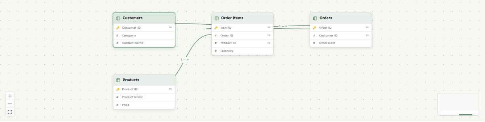
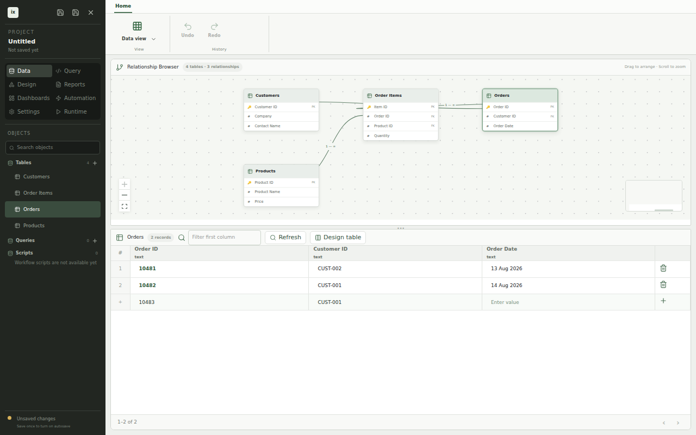

# Data view

_Data view puts project structure and record editing in one workspace._

Open Data view to see how tables relate before you change their records. The object browser, table browser, and records grid keep the current table in context.

## Object browser

The **object browser** groups tables, saved queries, and SQL scripts in the project sidebar. Select a table to make it active. Use the search field to narrow a larger project by object name.

Each table entry includes its record count. Selecting a saved query opens it in Query mode, where you edit the SQL or the visual builder and run it with parameters.

## Table designer

Create a table from the object browser, then open its designer to change columns, the primary key, relationships, unique and check constraints, and indexes. Changes are staged in a pending list first. Each staged change shows whether the database applies it in place or rebuilds the table. A table rebuild or a drop shows its effect on existing rows before you apply it.

Columns use logical types such as `text`, `integer`, `decimal`, `date`, and `boolean`. ixtable maps each one to the matching SQLite or PostgreSQL type, so the same design works on either database.

## Table browser

The **table browser** draws each table as a node with its fields. Primary and foreign keys show how records connect across the project. You can pan, zoom, and arrange the canvas while the records grid stays available below it.

Selecting `Orders` keeps the same table active in the object browser, relationship canvas, and records grid. That shared selection prevents the diagram and data editor from drifting into different contexts.

## Records grid

The **records grid** displays fields as columns and records as rows. Enter values in the final draft row to add a record without opening another screen.

The screenshot shows a draft order with `ORD-10483` and `CUST-001`. The active row stays aligned with the fields above it so you can compare the new values with existing records.

Each edit is written to the database at once. Constraint failures, such as a duplicate key or a missing related record, appear next to the grid and leave the record unchanged. Tables with optimistic concurrency reject an edit made from stale values and show the current ones. Page through large tables with the previous and next page buttons.

## Ribbon commands

The ribbon groups workspace actions by task. The View control switches between every mode, and Undo and Redo apply to design changes across the project. Record edits are not part of undo, because they are already saved in the database.

## Next steps

- [Overview](/docs/)
- [Design view](./design-view)
- [Testing](./testing)
