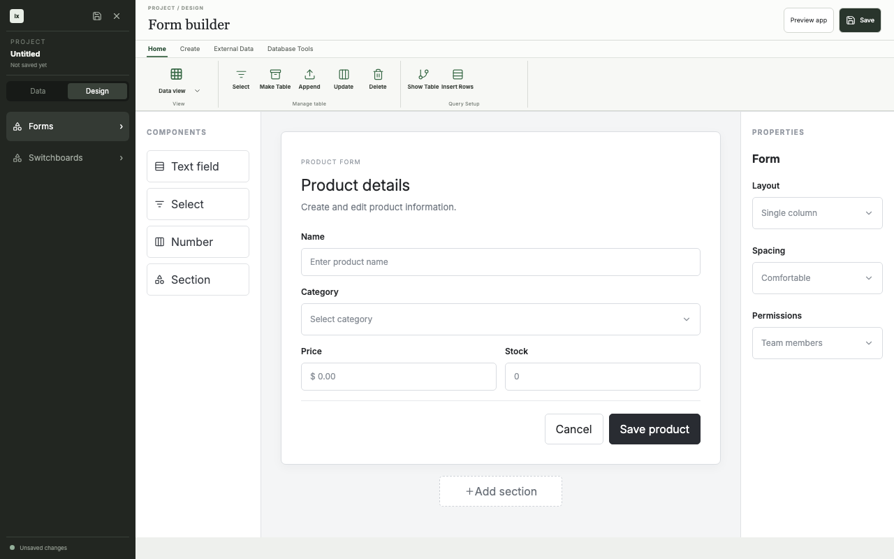
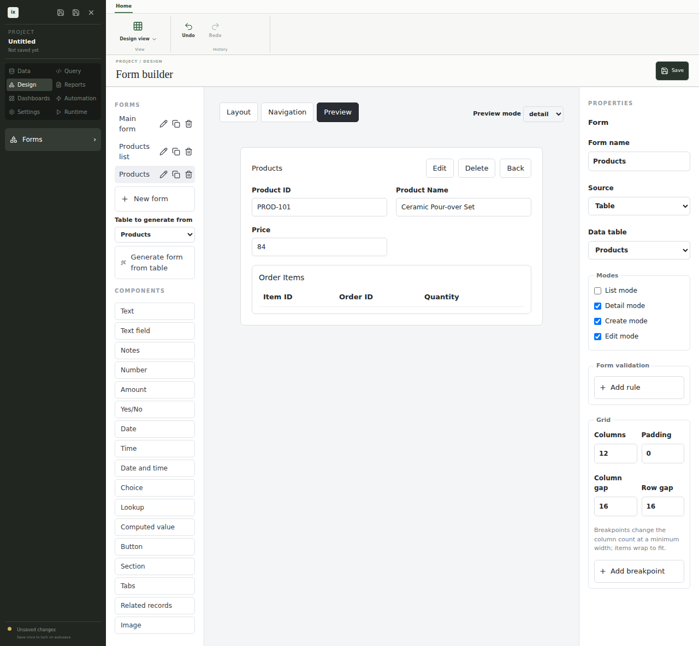

# Design view

_Design view builds the forms that people use to list, view, create, and edit records._

A form reads from a table or a saved query and shows its fields as controls on a grid. You can generate a starting set of forms from a table, then rearrange and extend them. The [Runtime](../guides/runtime-forms) renders the same form definition that you design here.

## Form builder

The form builder places controls on a shared grid and shows settings for the selected control. The grid has fractional, fixed, and content-sized columns, row and column spans, gaps, named regions, and breakpoints for narrow windows. Dashboards use the same grid. ixtable stores the grid model in the project file and turns it into CSS only when it draws the form.

Controls include text, number, decimal, date, time, check box, and select inputs. Relationship pickers choose a related record, and related lists show child records inside a parent form. Sections and tabs group controls, and buttons run [actions](../guides/automation) from Automation mode. Resize or move the selected control with the toolbar buttons or with Alt and the arrow keys.

## Rules and expressions

Validation rules, computed fields, and conditions that hide or disable a control use the ixtable [expression language](../reference/expressions). An expression reads like a spreadsheet formula, such as `record.quantity * record.unitPrice`. Each expression field checks the formula as you type and flags unknown names. Expressions only see the record, the form, and the application state, and they cannot run code.

## Modes and navigation

Each form has list, detail, create, and edit modes. Preview a mode in the designer with live records. The navigation editor builds the application menu from forms, reports, dashboards, and tables. [Roles](../guides/roles) in Settings control which of those items each user can open and change.

## Next steps

- [Data view](./data-view)
- [Runtime forms](../guides/runtime-forms)
- [Expressions](../reference/expressions)
- [Testing](./testing)
- [Deployment](./deployment)
