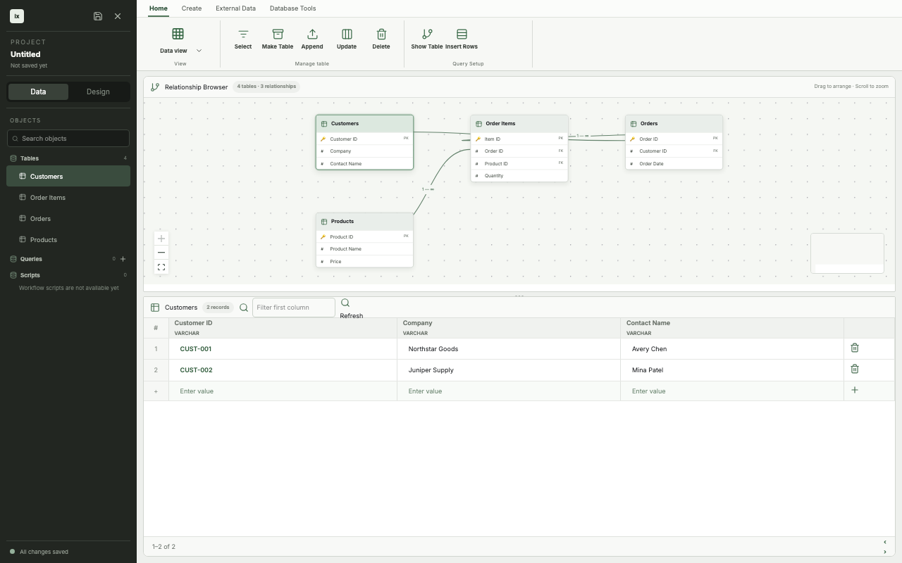

# Overview

_ixtable stores a small business app as one portable project file._

You work in two modes. **Data view** is where you inspect tables, follow relationships, and edit records. **Design view** is where you assemble the interface that people use to work with that data.



_This screenshot is generated from the real ixtable app by the repository's screenshot test._

## The project file

An ixtable project keeps the app definition and its data together. The project browser lists tables, saved queries, and SQL scripts on the left. Save and close actions apply to the whole project.

The current app opens a new, untitled project in memory. Saving that project requires a destination. The app reports `SAVE_AS_REQUIRED` until a Save As flow supplies one.

:::note TODO

Document the project file format, Save As flow, and compatibility rules when those parts are implemented.

:::

## The two views

| View | Use it for | Current state |
| --- | --- | --- |
| [Data view](./concepts/data-view) | Browse tables and relationships, then edit records in a grid | Available |
| [Design view](./concepts/design-view) | Build forms and preview an app interface | Work in progress |

Testing and deployment will complete the workflow from project file to running app. Both areas are still being designed.

## Generated screenshots

The images in these docs come from `scripts/screenshot/specs/app-shell.spec.tsx`. The test renders `src/App.tsx`, performs user actions, and captures the resulting app state with Playwright.

Regenerate the documentation images from the repository root:

```shell
npm run screenshot
```

The command tests the captured states before it copies selected images beside the documentation in `web/docs/assets`. Docusaurus fingerprints these relative assets when it builds the site.

## Next steps

- [Data view](./concepts/data-view)
- [Design view](./concepts/design-view)
- [Testing](./concepts/testing)
- [Deployment](./concepts/deployment)
